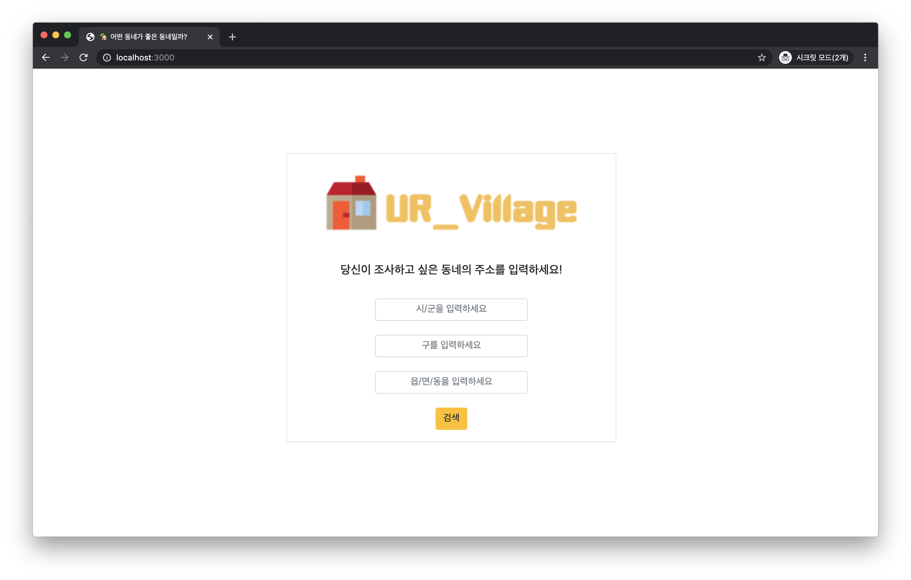
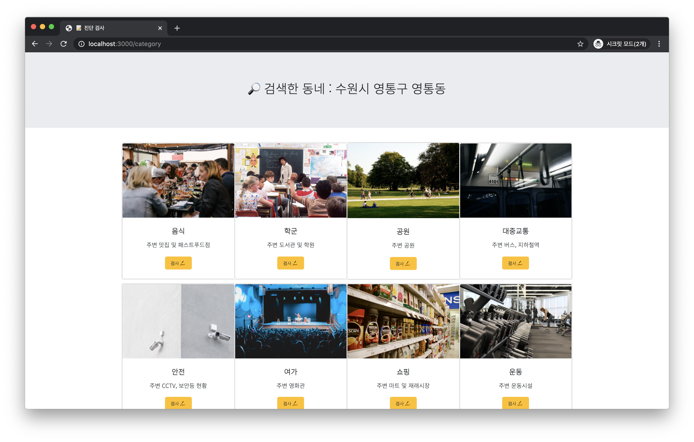
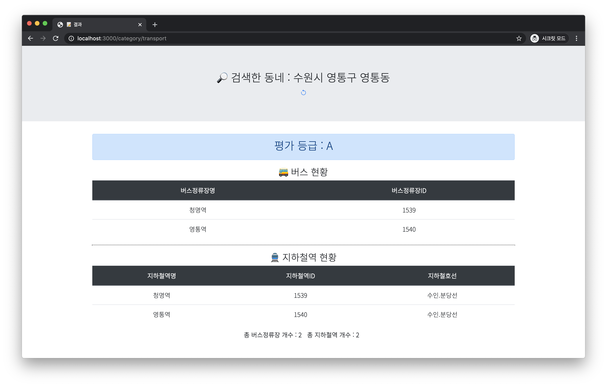

# 🏘 어떤 동네가 좋은 동네일까?

## 🏡 주제
현대인에게 있어 집 주변의 편의시설, 학군, 여가시설, 음식점 등은 매우 중요하다. 하지만 집을 알아볼 때 각 주소지별로 직접 일일이 검색하며 알아봐야 하는 불편함이 있다.  
따라서 본 프로젝트에서는 사용자가 자신이 알아보고자 하는 주소를 입력하면 그 **주소에 기반하여 각 카테고리(교통, 학군, 여가시설 등)에서의 점수**를 알려준다. 

## 👫 조원
* 컴퓨터공학과 안지영(2017110274)
* 컴퓨터공학과 이학주(2017104018)
* 컴퓨터공학과 정수연(2017104025)

## 📋 사용방법
http://www.abouturvillage.tk:3000/ (2021.07.17 기준 - deprecated) 접속하여 사용해보실 수 있습니다!  
**1.  주소지 입력**

**2.  알고싶은 카테고리를 선택하여 검사**  
(음식, 학군, 공원, 대중교통, 안전, 여가, 쇼핑, 운동)

**3.  결과**  
해당 카테고리에 대한 `평가등급`을 보여준다.


## 🖥 개발환경
- Frontend : EJS template engine
- Backend : Express framework

## 📑 API 목록
-  Kakao Maps API
- 경기도 내 전철역 통계
- 경기도 내 맛집 현황
- 경기도 내 패스트푸드 일반음식점 현황
- 주요 반경 내 역 개수
- 학교 정보
- 학원 및 교습소 현황
- 경기도 도서관 현황
- 시장 및 마트 현황
- 자연공원 현황
- 체력단련장 업체 현황
- 경기도 내 공공체육시설 현황
- CCTV 현황

## 🔌 실행방법
> **1. repository clone 하기**
```bash
$ git clone http://khuhub.khu.ac.kr/zuzitsu/UR_Village.git
```

> **2. .env 파일 추가**
```bash
$ cd UR_Village
```
>> 1. /UR_VIllage 위치에서 `.env 파일`을 추가
>> 2. .env 파일에서 발급받은 Kakao maps, 경기데이터드림, ODsay api key 추가  
>> [경기데이터드림](https://data.gg.go.kr/portal/intro/develop/searchBulletinPage.do), 
>> [Kakao developers](https://developers.kakao.com/),
>> [ODsay](https://lab.odsay.com/)

```
KAKAO_APIKEY=[YOUR_API_KEY]  
GYEONGGI_APIKEY=[YOUR_API_KEY]
ODSAY_APIKEY=[YOUR_API_KEY]
```

> **3. 실행**
```bash
$ npm install
$ npm start
```

> **4. `http://localhost:3000` 에 접속!**

## 📎 License
[MIT LICESNE](http://khuhub.khu.ac.kr/zuzitsu/UR_Village/blob/master/LICENSE)

### **[KHUHUB-original repository](http://khuhub.khu.ac.kr/zuzitsu/UR_Village)** 